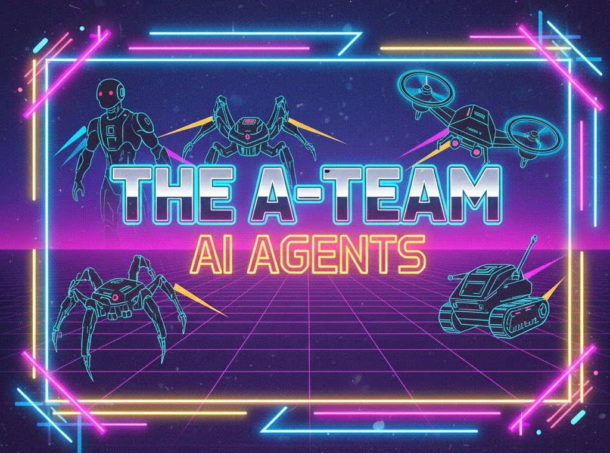

# The A-Team - AI Agents for SaaS Development

A comprehensive suite of specialized AI agents for brainstorming startup ideas, creating product specifications, and building full-stack applications.

## Available Agents (22 total)

### Business & Product Agents (4)
1. **Market Research** (`agents/startups/market-research.md`) - Market analysis, competitive landscape, revenue potential
2. **Pricing** (`agents/startups/pricing.md`) - Revenue models, pricing strategies, tier architecture
3. **Product Manager** (`agents/startups/product-manager.md`) - Interactive PRD creation, feature prioritization
4. **Domain Finder** (`agents/startups/domain-finder.md`) - Brandable domain names, availability checking

### Frontend Development Agents (3)
5. **Frontend Design** (`agents/frontend-design.md`) - UI/UX design with TanStack Start, React 19, Tailwind CSS v4
6. **Frontend Architect** (`agents/frontend-architect.md`) - Application architecture, routing, state management, SSR strategies
7. **Frontend Developer** (`agents/frontend-developer.md`) - Feature implementation with TanStack Query/Router/Table/Form

### Backend Development Agents (1)
8. **Golang REST API Developer** (`agents/api-golang/rest-api-developer.md`) - Production-ready APIs with Go 1.23+, PostgreSQL, pgx/v5, sqlc

### iOS Development Agents (10)
9. **SwiftUI Developer** (`agents/ios/swiftui-developer.md`) - Declarative UI, state management, animations, platform-adaptive experiences
10. **MVVM Architect** (`agents/ios/mvvm-architect.md`) - MVVM architecture with Combine, clean separation of concerns
11. **SwiftData Specialist** (`agents/ios/swiftdata-specialist.md`) - SwiftData persistence, Core Data migration, data modeling
12. **Networking Expert** (`agents/ios/networking-expert.md`) - URLSession, async/await, API integration, error handling
13. **Testing Expert** (`agents/ios/testing-expert.md`) - XCTest, UI testing, test coverage, TDD practices
14. **Performance Engineer** (`agents/ios/performance-engineer.md`) - Performance optimization, profiling, memory management
15. **Accessibility Expert** (`agents/ios/accessibility-expert.md`) - VoiceOver, Dynamic Type, inclusive app design
16. **Security Tester** (`agents/ios/security-tester.md`) - Security best practices, keychain, data protection
17. **Code Reviewer** (`agents/ios/code-reviewer.md`) - Code quality, Swift best practices, architectural review
18. **Debugger** (`agents/ios/debugger.md`) - Debugging techniques, crash analysis, Instruments profiling

### Agent Categories Summary
- **Startup Validation**: Market research, pricing, product specs, branding
- **Web Development**: Modern full-stack with React & Go
- **iOS Development**: Complete SwiftUI/UIKit development lifecycle

## Usage

Load an agent in [Claude Code](https://claude.ai/code) by adding them to the `.claude/agents` folder.

```
Please act as the @[Agent Name] agent and help me with [your request].
```

### Example Workflows

**Startup Validation:**
1. Market Research → analyze opportunity
2. Pricing → design revenue model
3. Product Manager → create PRD
4. Domain Finder → secure brand

**Frontend Development:**
1. Frontend Architect → design app structure
2. Frontend Design → create UI system
3. Frontend Developer → implement features

**Backend Development:**
1. Golang REST API Developer → build REST API with PostgreSQL

**Full-Stack Web Development:**
1. Market Research → validate idea
2. Product Manager → define requirements
3. Golang REST API Developer → build backend
4. Frontend Architect → design frontend
5. Frontend Developer → implement UI
6. Domain Finder → secure brand

**iOS App Development:**
1. MVVM Architect → design app architecture
2. SwiftUI Developer → build UI components
3. SwiftData Specialist → implement persistence
4. Networking Expert → integrate APIs
5. Testing Expert → write tests
6. Accessibility Expert → ensure inclusivity

## Key Features

- **Interactive Discovery** - Agents ask questions rather than make assumptions
- **Tool Integration** - Leverage WebSearch, WebFetch, Read, Write automatically
- **Realistic Analysis** - Data-driven, honest assessments
- **Type-Safe Code** - TypeScript for frontend, Go with sqlc for backend
- **Modern Stack** - Latest tools and best practices

## Tech Stacks

### Frontend
- **Framework**: TanStack Start (full-stack React with SSR)
- **UI**: React 19 (Server Components, Suspense, Transitions)
- **Styling**: Tailwind CSS v4 (utility-first, dark mode)
- **Routing**: TanStack Router (file-based, type-safe)
- **Data**: TanStack Query (caching, mutations)
- **Forms**: TanStack Form (validation, type safety)
- **Tables**: TanStack Table (sorting, filtering, pagination)

### Backend
- **Language**: Go 1.23+ (modern idioms, generics)
- **Database**: PostgreSQL with pgx/v5 driver
- **Migrations**: golang-migrate
- **Type-Safe SQL**: sqlc code generation
- **Routing**: chi, gorilla/mux, fiber, or gin
- **Documentation**: OpenAPI 3.0 / Swagger
- **Auth**: JWT, OAuth2

### iOS
- **Framework**: SwiftUI 5.0+ for declarative UI
- **Architecture**: MVVM with Combine
- **Persistence**: SwiftData / Core Data
- **Networking**: URLSession with async/await
- **Testing**: XCTest, XCUITest
- **Minimum Deployment**: iOS 17.0+
- **Tools**: Xcode, Instruments, SwiftLint

## Agent Usage Examples

### Business & Product
```
Please act as the Market Research agent defined in agents/startups/market-research.md
and analyze the market for a mobile fitness tracking app.
```

### Frontend Development
```
Please act as the Frontend Architect agent defined in agents/frontend-architect.md
and design the application structure for a SaaS dashboard.
```

### Backend Development
```
Please act as the Golang REST API Developer agent defined in agents/api-golang/rest-api-developer.md
and help me build a user authentication API with PostgreSQL.
```

### iOS Development
```
Please act as the SwiftUI Developer agent defined in agents/ios/swiftui-developer.md
and help me implement a custom tab bar with animations.
```

## Documentation

- **`CLAUDE.md`** - Guide for Claude Code instances working in this repository
- **Individual agent files** - Detailed methodologies, best practices, and examples for each agent

## License

Apache License 2.0 - See [LICENSE](LICENSE) file for details
